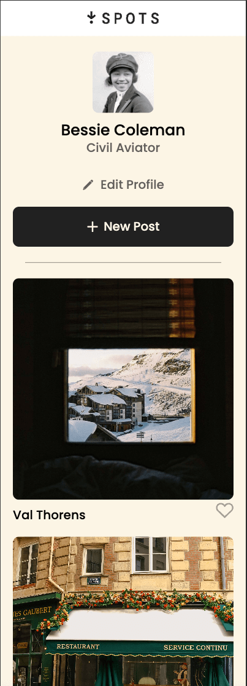
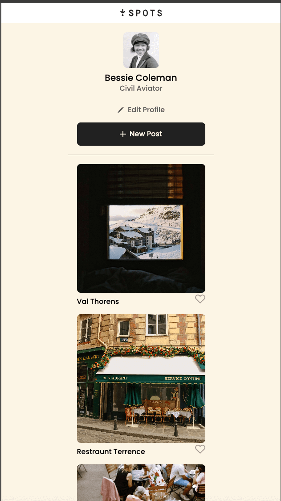
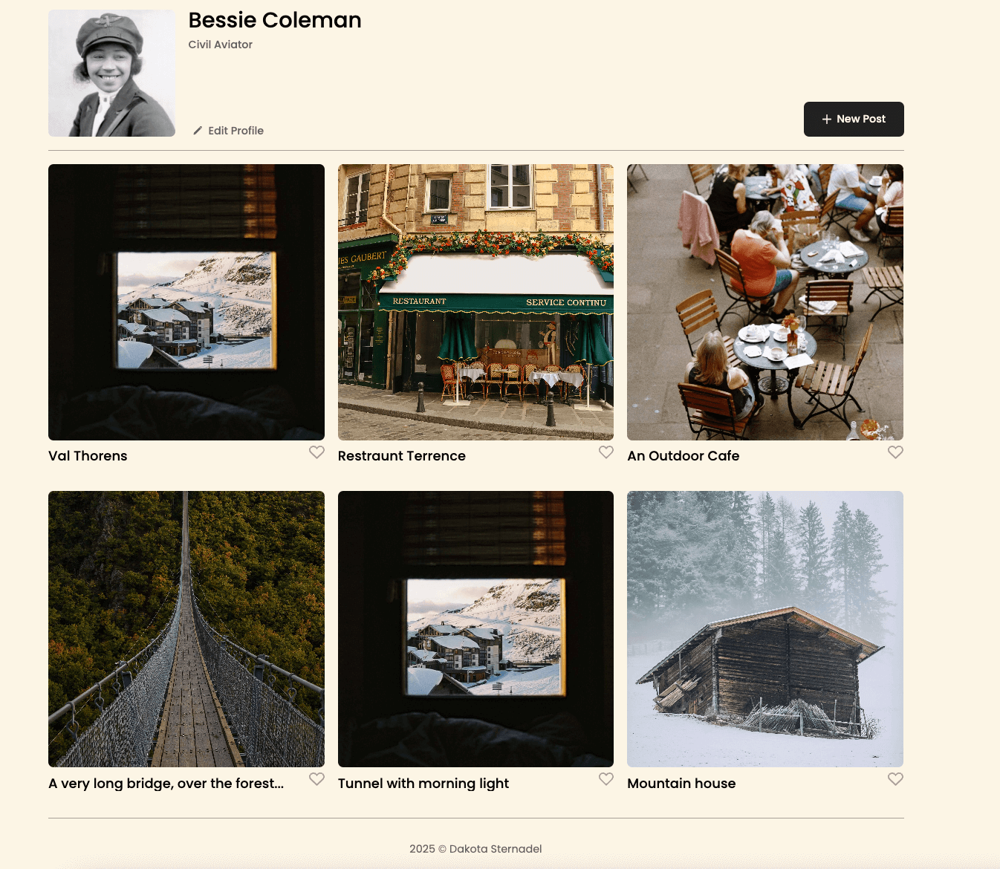

# Project 3: Spots

This is the beginning of a multi stage project, utilizing my knowledge in html and css to build a responsive and adaptive webapp. So far I have developed the basic structure, layout and styles of the page according to the brief.

## Project name:

Spots | Dakz

## Project Description:

This multi-platform web application offers a veriety of advance and innoavive technologiacal features, from different screen sizes and adjustments to reactivity through out the whole app. I have built a systemn that adapts to the users needs weather they are on the go or at home!
They have the ability to express their self as they see fit

## Project Features

- Semantic HTML5
- BEM File Structure
- CSS3
- Media Queries
- Flexgrid and Flexbox Containers
- Responsive Layout
- Hover and Color Changing buttons

## Future Improvments

- Developing a Backend, Using Javascript
- More features to customize and style your profile, to it give a more personal touch
- Ways to capture and share moments right in the app, so you can express yourself to your peers without missing a beat

## Overview

- Links
- Images
- Video

**Links**

- [Link to the project on Figma](https://www.figma.com/file/BBNm2bC3lj8QQMHlnqRsga/Sprint-3-Project-%E2%80%94-Spots?type=design&node-id=2%3A60&mode=design&t=afgNFybdorZO6cQo-1)

- [Link to Github Pages](https://dakz06.github.io/se_project_spots/)

**Images**

**Video**
